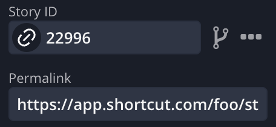

# Shortcut Buttons Extension
Chrome Extension for Adding Useful Shortcut Buttons

## Features
* Adds a button to copy the story link in Markdown format

## Todo
* Add a button to copy the story Title to the clipboard

### How to load extension
[Loading an unpacked extension](https://developer.chrome.com/docs/extensions/mv3/getstarted/development-basics/#load-unpacked)

Guides and Inspiration
 * [Chrome Extension Tutorial](https://developer.chrome.com/docs/extensions/mv3/getstarted/)
